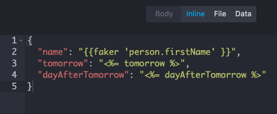
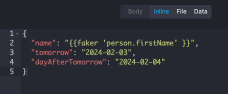

# Mockoon dynamic templates with EJS

This is a simple example of how to use dynamic templates in [Mockoon](https://mockoon.com/) using [EJS](https://ejs.co/).

## Problem

Mockoon only supports dynamic responses using Faker.js, which is not enough for some use cases.

## Possible Solution

Using EJS to render placeholders in the response of the Mockoon endpoint before open the environment.

### Before



### After 



## How to use

This solution should be used with versioned Mockoon environments, so that you can reset local changes to run the replacement script again.

1. Close the Mockoon environment (`demo.json`)

2. Run the replacement script 

```
npm install
npm run replace
```

3. Open the Mockoon environment (`demo.json`)

## Extensibility

Extend the template replacements in [index.js](./index.js):

```javascript
const replacements = {
    tomorrow: calculateTomorrow(),
    dayAfterTomorrow: calculateDayAfterTomorrow()
};
```
